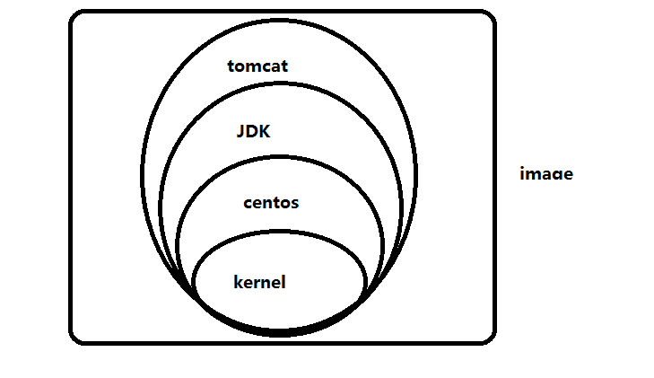
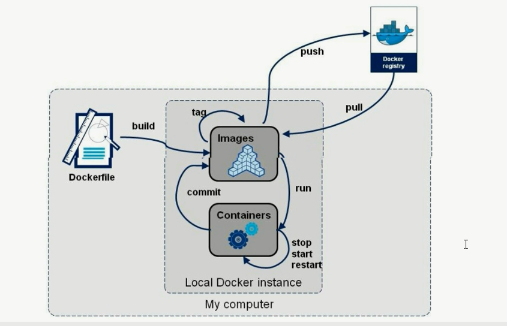
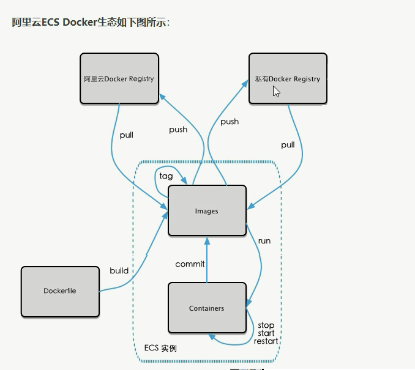
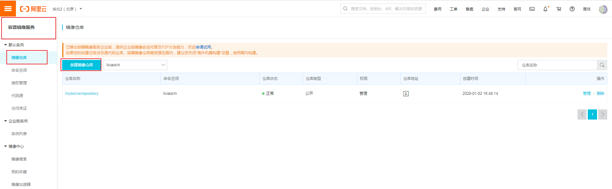
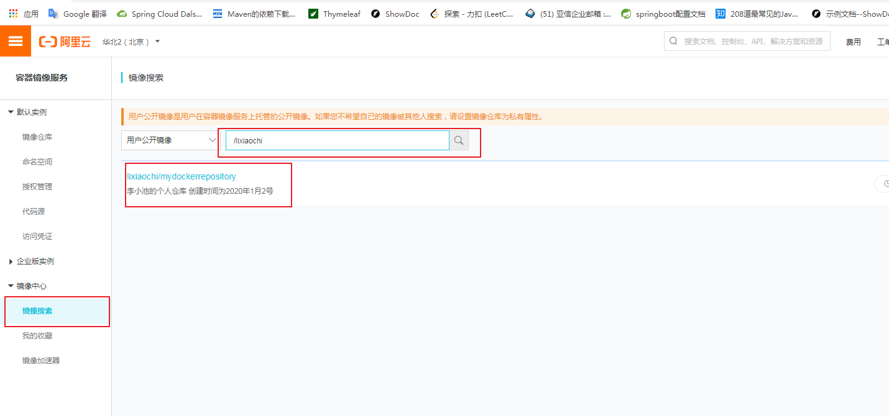

# Docker容器虚拟化技术

鲸鱼背上集装箱：

```
1.蓝色的大海里面----宿主机系统window10
2.鲸鱼----docker容器管理引擎系统
3.集装箱----容器实例
```

[TOC]

## 1.Docker简介

​		学习docker之前，需要具有的前提知识，

​        1.强制：熟悉Linux命令和相关背景知识。

​        2.建议：Maven/Git相关的知识，git pull,git commit,git add

###  1.Docker是什么，一次构建，封装，处处运行。

​        **问题1：为什么会有Docker出现。**

​        解释：一款产品从开发到上线，从操作系统，到运行环境，再到应用配置。作为开发+运维之间的协作我们需要关心很多东西，这也是很多互联网公司都不得不面对的问题（开发阶段的代码之所以到运维就出现问题，主要的所以是代码的环境和配置出现了变化），特别是各种版本的迭代之后，不同版本环境的兼容，对运维人员都是考验。**Docker**之所以发展如此迅速，也是因为它对此给出了（解决环境和配置的）一个标准化的解决方案。环境配置如此麻烦，换一台机器，就要重来一次，费时费力。很多人想到，能不能从根本上解决问题，**软件可以带环境安装？**也就是说，安装的时候，把原始环境一模一样地复制过来。开发人员利用Docker可以消除协作编码时“在我的机器上可以正常工作”的情况。

> ```java
> // Docker包含两个方面技术：
>    1.镜像技术：(代码+原始环境)安装到Docker
> /* 
>    之前在服务器配置一个应用的运行环境，要安装各种软件（redis，mysql，RabbitMQ，Tomcat等）。安装和配置这写东西有多麻烦就不说了，它还不能跨平台，每一台都需要这样安装一遍。加入我们是在windows上安装这些环境，在Linux系统上又要重新的安装，况且就算不跨操作系统，换另一台同样操作系统的服务器，要移植应用也是非常麻烦的。
>    传统上认为，软件编码开发/测试结束后，所产出的成果即是程序和程序编译后的二进制字节码等。而为了让这些程序可以顺利执行，开发团队也得准备完整的部署文件，让运维团队得以部署应用程序，开发需要清楚的告诉运维部署团队，用的全部配置文件+所有软件环境。不过，即便如此，仍然常常发生部署失败的状况。Docker镜像的设计使得Docker得以打破过去[程序即应用]的观念，通过镜像(images)技术可以将作业系统核心除外，将运行应用程序所需的系统环境，由下到上打包，达到应用程序跨平台的无缝接轨运作。
> */
> ```

​      Linux系统容器技术的出现就解决了这样的一个问题，而Docker就是在它的基础上发展过来的。将应用运行在Docker容器上面，而Docker容器在任何操作系统上都是一致的，这实现了跨平台、跨服务器，只需要一次配置好环境，换到别的机子上就可以一键部署好，大大提高效率，简化了操作。

**总结一句话：解决了运行环境和配置问题的软件容器（每一个容器就安装着开发工程所需要的软件），方便做持续集成并有助于整体发布的容器虚拟化技术。**

​        **问题2：容器化虚拟技术和传统的VM虚拟机的差别？**

​        虚拟机（virtual machine）就是带环境安装的一种解决方案。它可以在一种操作系统里面运行另一种操作系统，比如在windows系统里面可以安装Linux系统。应用程序对此毫无感觉，因为虚拟机看上去和真实系统一模一样，而对于底层系统来说，虚拟机就是一个普通文件，不需要了就删除，对其他部分毫无影响。这类虚拟机完美的运行了另一套系统，能够使应用程序，操作系统和硬件三者之间的逻辑不变。

​       虚拟机的缺点：1.资源占用多（硬件模拟）    2.冗余步骤多     3.启动慢（运行一个新的操作系统）。

​       容器化虚拟技术因为前面虚拟机存在这些缺点，Linux发展出了另一种虚拟化技术，LInux容器（Linux Contains，缩写LXC）。

​       linux容器不是模拟一个完整的操作系统（对原有操作系统进行减法，一个简易的操作系统），而是对进程进行隔离。有了容器，就可以将软件运行所需的所有资源打包到一个隔离的容器中。容器与虚拟机不同，不需要捆包一整套操作系统，只需要软件工作  所需的库资源和设置，系统因此而变得高效轻量并保证部署在任何环境中都能始终如一地运行。

​      比较了Docker和传统虚拟化方式的不同之处：

​      **传统虚拟化技术是虚拟出一套硬件（比如VM虚拟机，安装VM软件后，会虚拟化出一系列硬件，在这些虚拟的硬件资源上运行一个完整的操作系统，然后运行应用程序），在其上运行一个完整操作系统，在该系统上再运行所需应用程序。**

​      **而容器内的应用进程直接运行于宿主的内核，容器内没有自己的内核，而且也没有进行硬件虚拟。因此容器要比传统虚拟机更为轻便。每个容器之间相互隔离，每个容器有自己的文件系统，容器之间进程不会相互影响，能区分计算资源。**

​     总结：开发自运维，一次构建，随处运行，Docker容器技术有更快速的应用交付和部署，更便捷的升级和扩缩容，更简单的系统维护，更高效的计算资源利用。**启动快和打包部署快。**

## 2.下载Docker

​      1.官网 ：docker官网：http://www.docker.com

​                      docker中文网站：https://www.docker-cn.com/

​      2.仓库：Docker Hub官网：https://hub.docker.com/

## 3.安装Docker

###       1.Docker的基本组成：

####            1.镜像（images）

```
Docker镜像（image）就是一个只读的模板。镜像可以用来创建Docker容器，一个镜像可以创建多个容器。
容器与镜像的关系类似于面向对象编程中的对象和类。
```

| Docker | 面向对象 |
| ------ | -------- |
| 容器   | 对象     |
| 镜像   | 类       |

####            2.容器（contains）

```
Docker利用容器（Container）独立运行的一个或一组应用。容器是用镜像创建的运行实例。它可以被启动、开始、停止、删除。每个容器都是相互隔离的、保证安全的平台。可以把容器看做是一个简易版本的Linux环境（包括root用户权限、进程空间、用户空间和网络空间等）和运行在其中的应用程序。容器的定义和镜像几乎一模一样，也是一堆层的统一视角，唯一区别在于容器的最上面那一层是可读可写的。
```

####            3.仓库（repository）

```
仓库(Repository)是集中存放镜像文件的场所。
仓库(Repository)和仓库注册服务器(Registry)是有区别的。仓库注册服务器上往往存放多个仓库，每个仓库中包含了多个镜像，每个镜像有不同的标签(tag)。
仓库分为公开仓库(public)和私有仓库(Private)两种形式。最大的公开仓库是Docker Hub。存放了数量庞大的镜像供用户下载。国内的公开仓库包括阿里云、网易云等。
```

  **总结：Docker本身是一个容器运行载体或称之为管理引擎。我们把应用程序和配置依赖打包好形成一个可交付的运行环境，这个打包好的运行环境就似乎image镜像文件。只有通过这个镜像文件才能生成Docker容器。image文件可以看作是容器的模板。Docker根据image镜像文件生成容器的实例。同一个image文件，可以生成多个同时运行的容器实例。**

image文件生成的容器实例，本身也是一个文件，称为镜像文件。

一个容器运行一种服务，当我们需要的时候，就可以通过docker客户端创建一个对应的运行实例，也就是我们的容器。

至于仓库，就是放了一堆镜像的地方，我们可以把镜像发布到仓库中，需要的时候从仓库中拉下来就可以了。

###         2.Docker的安装步骤

####                   1.Centos系统下安装Docker

```
1.yum install -y epel-release
2.yum install -y docker-io
3.安装后的配置文件：/etc/sysconfig/docker
4.启动Docker后台服务：service docker start
5.dockerversion 验证
```

####                   2.Ubuntu下安装Docker

```
// 在安装之前先要更新apt软件包。
0.apt-get update
1.apt-get install -y docker.io
2.systemctl start docker
3.systemctl enable docker
4.docker version
```

####                   3.阿里云镜像加速

```
// 阿里云服务平台控制台---产品与服务----容器镜像服务-----镜像加速器---操作文档。
1.https://dev.aliyun.com/search.html
2.注册一个属于自己的阿里云账号（可复用淘宝账号）
3.获得加速器地址链接
4.配置本机Docker运行镜像加速器
5.重新启动Docker后台服务：service docker restart / systemctl restart docker
6.Linux系统下配置安全需要查看加速器是否生效。


sudo mkdir -p /etc/docker
sudo tee /etc/docker/daemon.json <<-'EOF'
{
  "registry-mirrors": ["https://gwocidtk.mirror.aliyuncs.com"]
}
EOF
sudo systemctl daemon-reload
sudo systemctl restart docker
```

####                   4.Docker的底层原理，是怎么工作的？

```
Docker是一个Client-Server结构的系统，Docker守护进程运行在主机上，然后通过Socket连接从客户端访问，守护进程从客户端接收命令并管理运行在主机上的容器。容器，是一个运行时环境，就是我们前面的一个个集装箱。换句话说即使，服务端有一个守护进程，专门接受来自客户端部的命令，并通过命令对运行在服务器上的容器进行管理。
   1.Docker有着比虚拟机更少的抽象层。由于docker不需要Hypevisor实现硬件资源虚拟化，运行在docker容器上的程序直接使用的都是物理机上的硬件资源。因此在CPU，内存利用率上Docker将会在效率上有名明显的优势。
   2.docker利用的是宿主机的内核，而不需要GuestOs，因此当新建一个容器时，docker不需要和虚拟机一样重新加载一个操作系统内核。因而避免了寻找，加载操作系统内核这个费时费资源的过程，当新建一个虚拟机时，虚拟机软件需要加载一个完整的操作系统，反正新建过程是分钟级别的，而docker由于直接利用宿主机的操作系统，则省略了这个过程，因此新建一个docker容器只需要几秒钟。
```

## 3.Docker的基本常用命令

#### 1.docker帮助命令

##### 		1.docker version、docker info、docker --help

```
docker version  //看docker的版本信息
docker info     //看docker更加详细的信息，比如容器和镜像的个数

docker --help   //查看docker的一些使用命令，查看帮助文档
attach      Attach local standard input, output, and error streams to a running container
  build       Build an image from a Dockerfile
  commit      Create a new image from a container's changes
  cp          Copy files/folders between a container and the local filesystem
  create      Create a new container
  diff        Inspect changes to files or directories on a container's filesystem
  events      Get real time events from the server
  exec        Run a command in a running container
  export      Export a container's filesystem as a tar archive
  history     Show the history of an image
  images      List images
  import      Import the contents from a tarball to create a filesystem image
  info        Display system-wide information
  inspect     Return low-level information on Docker objects
  kill        Kill one or more running containers
  load        Load an image from a tar archive or STDIN
  login       Log in to a Docker registry
  logout      Log out from a Docker registry
  logs        Fetch the logs of a container
  pause       Pause all processes within one or more containers
  port        List port mappings or a specific mapping for the container
  ps          List containers
  pull        Pull an image or a repository from a registry
  push        Push an image or a repository to a registry
  rename      Rename a container
  restart     Restart one or more containers
  rm          Remove one or more containers
  rmi         Remove one or more images
  run         Run a command in a new container
  save        Save one or more images to a tar archive (streamed to STDOUT by 
```

#### 2.docker镜像命令

#####          1.docker images  [-a]  列出本地祝你上的镜像

```
REPOSITORY    TAG           IMAGE ID       CREATED         SIZE
hello-world   latest        fce289e99eb9   12 months ago   1.84kB
REPOSITORY  表示镜像的仓库源    镜像名称
TAG         表示镜像的标签       
IMAGE ID    表示镜像的ID  
CREATED     表示镜像的创建时间
SIZE        表示镜像的大小
// 这个指令具有的可选参数：
-a   列出本地所有的镜像（含中间镜像）
-q   只显示镜像ID
docker images -a 
--dgests    显示镜像的摘要信息
--no-trunc  显示完整的镜像信息

```

#### 2.docker search 【options】 xxx  某个镜像的名字

```
docker search 【options】 镜像名称
options说明： -no-trunc 显示完整的镜像信息
             -s 列出收藏数不小于指定值的镜像
             --automated   只列出automated build类型的镜像 
```

#### 3.docker  pull 镜像 下载某个xxx镜像

```
docker pull 镜像名称 【:TAG】
等价于 docker pull Tomcat:latest   没写版本号，自动下载最新版
```

#### 4.docker rmi 镜像ID/镜像名称   删除镜像 

```
rmi(remove image) 删除镜像
删除单个镜像 docker rmi hello-world
强制删除单个镜像 docker rmi -f hello-world
删除多个镜像 docker rmi -f 镜像名1：tag 镜像名2：tag
删除全部镜像 docker rmi -f $(docker images -qa)
```

### 3.docker容器命令

 有镜像才能创建容器，这是根本前提（下载一个Centos镜像演示）

```
1.docker pull centos   // 从docker hub中下载Centos镜像
2.docker run -it centos //-it以交互式启动容器，换句话说就是在docker中启动一个容器，并返回给终端和其交互。
docker run [options] image [command][ARG.]// 新建并启动容器 
3.// 
```

#### 1.docker run [options] image // 新建并启动容器

```
Options说明(常用)：有些是一个减号，有些是两个减号
--name="容器新名字"：为容器指定一个名字  不定义，随机分配一个
docker run -it --name mycentos centos
-d:后台运行容器，并返回容器ID，也即启动交互式容器。
-i:以交互模式运行容器，通常与-t同时使用。
-t：为容器重新分配一个伪输入终端，通常与-i同时使用
-P：随机端口映射。
-p：指定端口映射，有以下四种格式
  ip:hostPort:containerPort
  ip::containerPort
  hostPort:containerPort
  containerPort
-v：表示需要将本地哪个目录挂载到容器中，格式：-v <宿主机目录>:<容器目录>
```

#### 2.docker ps [options] 列出当前所有正在运行的容器

```
docker ps //查询docker有哪些容器在运行
【options】
-a:列出当前所有正在运行的容器+历史上运行过的。
-l:显示最近创建的容器
-n:显示最近n个创建的容器
-q:静默模式，只显示容器编号
--no-trunc:不截断输出
```

#### 3.exit / Ctrl+P+Q  突出容器的两种方法

```
1.exit 容器停止退出
2.Ctrl+P+Q 容器不停止退出
```

#### 4.docker start 容器ID或者容器名      启动一个容器

```
docker start 710864cdf979
```

#### 5.docker restart 容器ID或者容器名    重启容器

```
docker restart 710864cdf979
```

#### 6.docker stop 容器ID或者容器名    停止容器

```
docker stop 710864cdf979
docker stop $(docker ps -q)
// 强制停止一个容器
docker kill 710864cdf979
```

#### 7.docker rm 容器ID或者容器名

```
docker rm 710864cdf979
// 一次性删除多个容器
docker rm -f $(docker ps -a -p)
docker ps -a -1q | xargs docker rm
```

#### 8.docker镜像commit操作补充   提交

```
docker commit提交容器副本使之称为一个新的镜像
docker commit -m="提交的描述信息" -a="作者" 容器ID 要创建的目标镜像名:[标签名]
```

#### 9.docker提交案例   可以将你当前修改的容器重新构建成一个镜像保存在本地。 

```
1.从hub上下载Tomcat镜像到本地并成功运行   
docker pull tomcat
docker run -it -p 8080:8080 tomcat
-p 主机端口：docker容器端口
-P（大p）随机分配端口   -i 交互   -t终端
2.故意删除上一步镜像生产Tomcat容器的文档
docker exec -i -t 3b16f91dc07b /bin/bash
3.也即当前的Tomcat运行实例是一个没有文档内容的容器，以它为模板commit一个没有doc的Tomcat新镜像lixiaochi/tomcat02
docker commit -a="lixiaochi" -m="tomcat测试" 3b16f91dc07b lixiaochi/mytomcat1230
4.启动我们的新镜像和原来的比较
docker run -it -p 7777:8080 lixiaochi/mytomcat1230:lasest
```


#### 10.容器的重要内容

##### 1.启动守护式容器，即后台进程启动

```
1.启动守护式容器，即后台进程启动   docker run -d 容器名
问题：然后docker pa -a 进行查看，会发现容器已经退出
很重要的要说明的一点:Docker容器后台运行，就必须有一个前台进程，
容器运行的命令如果不是那些一直挂起的命令（比如运行top，tail）,就是会自动退出的。
这个是docker的机制问题，比如你的web容器，我们以NGINX为例，正常情况下，我们配置启动服务只需要响应的service即可，例如service nginx start
但是这样做，NGINX为后台进程模式运行就导致docker前台运行的应用。
这样的容器后台启动后，会立即自杀因为他觉得他没事可做了。
所以，最佳的解决方案是将你要运行的程序以前台进程的形式运行。
```

##### 2.查看容器日志 docker logs -f -t --tail 容器ID

```
docker run -d centos /bin/sh -c "while true;do echo hello zzyy;sleep 2;done"

-t 是加入时间戳
-f 跟随最新的日志打印
--tail 数字 显示最后多少条
root@iZ2ze5wrqkc93qtqlyerq9Z:~# docker logs -t -f --tail 20 381435ac7e06
2019-12-30T07:15:42.247712090Z hello zzyy
2019-12-30T07:15:44.249919217Z hello zzyy
2019-12-30T07:15:46.251696593Z hello zzyy
2019-12-30T07:15:48.253501211Z hello zzyy
2019-12-30T07:15:50.255284831Z hello zzyy
2019-12-30T07:15:52.256394736Z hello zzyy
```

##### 3.查看容器内运行的进程  docker top 容器 ID

```
docker top 381435ac7e06
```

##### 4.查看容器内部的细节，以JSON串的形式显示容器内部细节。

```
docker inspect 容器ID
```

##### 5.进入正在运行的容器并以命令行交互

```
docker exec -it 容器ID bashShell
docker exec -t 1eb093259604 /bin/bash
重新进入docker attach 容器ID
上述两个的区别：
1.docker exec -t 1eb093259604 ls -l /tmp
是在容器中打开新的终端，并且可以启动新的进程，换句话说就是进入容器，执行命令，将返回结果返回给宿主机。
2.docker attach 1eb093259604
直接进入容器启动命令的终端，不会启动新的进程。
所以exec的功能比attach更加强大，可以不进入容器，直接将在容器中执行的方法返回给宿主机。
```

##### 6.从容器内拷贝文件到主机上

```
docker cp 容器ID:容器内路径 目的主机路径
```

##### 7.docker常用命令

```
常用命令
attach    Attach to a running container                 
# 当前 shell 下 attach 连接指定运行镜像build     
Build an image from a Dockerfile # 通过 Dockerfile 定制镜像commit   
Create a new image from a container changes  # 提交当前容器为新的镜像cp        Copy files/folders from the containers filesystem to the host path   
#从容器中拷贝指定文件或者目录到宿主机中create    
Create a new container    # 创建一个新的容器，同 run，但不启动容器diff      Inspect changes on a container's filesystem   # 查看 docker 容器变化events    Get real time events from the server          # 从 docker 服务获取容器实时事件exec      Run a command in an existing container        # 在已存在的容器上运行命令export    Stream the contents of a container as a tar archive   # 导出容器的内容流作为一个 tar 归档文件[对应 import ]history   Show the history of an image                  # 展示一个镜像形成历史images    List images                                   # 列出系统当前镜像import    Create a new filesystem image from the contents of a tarball # 从tar包中的内容创建一个新的文件系统映像[对应export]info      Display system-wide information               # 显示系统相关信息inspect   Return low-level information on a container   # 查看容器详细信息kill      Kill a running container                      # kill 指定 docker 容器load      Load an image from a tar archive              # 从一个 tar 包中加载一个镜像[对应 save]login     Register or Login to the docker registry server    # 注册或者登陆一个 docker 源服务器logout    Log out from a Docker registry server          # 从当前 Docker registry 退出logs      Fetch the logs of a container                 # 输出当前容器日志信息port      Lookup the public-facing port which is NAT-ed to PRIVATE_PORT    # 查看映射端口对应的容器内部源端口pause     Pause all processes within a container        # 暂停容器ps        List containers                               # 列出容器列表pull      Pull an image or a repository from the docker registry server   # 从docker镜像源服务器拉取指定镜像或者库镜像push      Push an image or a repository to the docker registry server    # 推送指定镜像或者库镜像至docker源服务器restart   Restart a running container                   # 重启运行的容器rm        Remove one or more containers                 # 移除一个或者多个容器rmi       Remove one or more images             # 移除一个或多个镜像[无容器使用该镜像才可删除，否则需删除相关容器才可继续或 -f 强制删除]run       Run a command in a new container              # 创建一个新的容器并运行一个命令save      Save an image to a tar archive                # 保存一个镜像为一个 tar 包[对应 load]search    Search for an image on the Docker Hub         # 在 docker hub 中搜索镜像start     Start a stopped containers                    # 启动容器stop      Stop a running containers                     # 停止容器tag       Tag an image into a repository                # 给源中镜像打标签top       Lookup the running processes of a container   # 查看容器中运行的进程信息unpause   Unpause a paused container                    # 取消暂停容器version   Show the docker version information           # 查看 docker 版本号wait      Block until a container stops, then print its exit code   # 截取容器停止时的退出状态值 
```

## 4.docker 镜像

### 1.Docker镜像是什么？

​     docker中镜像是一种轻量级、可执行的独立软件包，用来打包软件运行环境和基于运行环境开发的软件，它包含软件运行的所有内容，包括代码、运行时、库、环境变量和配置文件。

```
UnionFS(联合文件系统)
Docker镜像加载原理
分层的镜像
为什么docker镜像要采用这种分层结构呢？
```

### 2.UnionFS(联合文件系统)

​    UnionFS (联合文件系统)：Union文件系统（Unios）是一种分层、轻量级并且高性能的文件系统，它支持对文件系统的修改作为一次次提交来一层层的叠加，同时可以将不同目录挂载到同一个虚拟文件系统下。Union文件系统是Docker镜像的基础，镜像可以通过分层来进行继承，基于基础镜像（没有父镜像），可以制作各种具体的应用镜像。

特点：一次同时加载多个文件系统，但从外面来看，只能看到一个文件系统，联合加载会把各层文件系统叠加起来，这样最终的文件系统会包含所有底层的文件和目录。

### 3.Docker镜像加载原理

Docker镜像加载原理：docker的镜像实际上由一层一层的文件系统组成，这种层级的文件系统UnionFS。bootfs(boot file system)主要包含bootloader和kernel，bootloader主要是引导加载kernel，Linux刚启动时会加载bootfs文件系统，在Docker镜像的最底层是bootfs。这一层与我们典型的LInux/unix系统是一样的，包含boot加载器和内核。当boot加载完成之后这个内核就都在内存中了。此时内存的使用权已由boot方式转交给内核，此时系统也会卸载bootfs。


rootfs（root file system）,在bootfs之上，包含的就是典型Linux系统中的/dev、/proc、/bin等标准目录和文件。rootfs就是各种不同的操作系统发行版，不如ubuntu，Centos等等。

平时我们安装进虚拟机的Centos都是好几个G，为什么docker这里才200M。

对于一个精简版的操作系统，rootfs可以很小，只需要包含最基本的命令、工具和程序库就可以了，因为底层直接用Host的kernel，自己只需要提供rootfs就行了。由此可见对于不同的linux发行版，bootfs基本上是一致的，rootfs会有差别，因此不同的发行版可以公用bootfs。

### 4.分层镜像

最大的好处就是--共享资源。比如：有多个镜像都从相同的base镜像构建而来，那么宿主机只需要磁盘上保存一份base镜像，同时内存中也只需加载一份base镜像，就可以为所有容器服务了。而且镜像的每一层都可以被共享。



特点：Docker镜像都是只读的。当容器启动时，一个新的可写层加载到镜像的顶部。这一层被称为容器层，容器层之下的都叫镜像层。

## 5.docker 容器数据卷

###   1.docker数据卷是什么，能干什么？

​     先来看看docker的理念： 

​		1.将运用与运行的环境打包形成容器运行，，运行可以伴随容器，但是我们希望运行是产生的数据的要求希望是持久化的。

​        2.容器之间希望有可能共享数据

   docker容器产生的数据，如果不通过docker commit 生成新的镜像，使得数据做为镜像的一部分保存起来，那么当容器删除后，数据自然也就没有了。为了能保存数据在docker中我们使用卷。

**总结1：一句话，有点类似我们Redis里面的rdb和aof文件，总要实现容器的数据持久化、容器间的继承+共享数据**

**总结2：卷就是目录或文件夹，存在于一个或多个容器中，由docker挂载到容器，但不属于联合文件系统，因此能够绕过Union File System提供一些用于持续存储或共享数据的特性，卷的设计目的就是数据的持久化，完全独立于容器的生存周期，因此Docker不会在容器删除时删除其挂载的数据卷。**

**具有以下特点：**

​		**1.数据卷可在容器之间共享或重用数据。**

​        **2.卷中的更改可以直接生效。**

​        **3.数据卷中的更改不会包含在镜像的更新中。**

​        **4.数据卷的生命周期一致持续到没有容器使用它为止。**

###    2.数据卷，容器内添加

####        1.直接命令添加   将宿主机路径挂载到容器内

```
1.命令：docker run -it -v /宿主机绝对路径目录:/容器内目录 镜像名
 docker run -it -v /myDataVolume:/dataVolumeContainer centos /bin/bash
2.查看数据卷是否挂载成功
3.容器和宿主机之间数据共享
4.容器停止退出后，主机修改后数据是否同步。
5.命令(带权限) 采用只读的方式挂载，容器只能读不能修改，但是主机是可以修改同步到容器的。 
docker run -it -v /myDataVolume:/dataVolumeContainer:ro centos /bin/bash
```

####        2.DockerFile添加       实际上就是镜像的描述文件，自己的一套语法。

```
1.根目录下新建mydocker文件夹并进入
2.可在Dockerfile中使用VOLUME指令来给镜像添加一个或多个数据卷
VOLUME["/dataVolumeContainer","/dataVolumeContainer2","/dataVolumeContainer3"]
    说明：
    出于可移植和分享的考虑，用-v 主机目录：容器目录这种方法不能够直接在Dockerfile中实现。
    由于宿主机目录是依赖于特定宿主机的，并不能够保证在所有的宿主机上都存在这样的特定的目录。
3.File构建
    #volume test
    FROM centos
    VOLUME ["/dataVolumeContainer","/dataVolumeContainer2"]
    CMD echo "finished,-------success1"
    CMD /bin/bash
4.build后生成镜像   获得另一个新镜像lixiaochi/centos
    使用docker build构建，可以将一个dockerfile构建成一个新镜像。
    docker build -f /mydocker/dockerfile -t lixiaochi/mycentos .
5.run容器
    docker run -it lixiaohci/mycentos /bin/bash
6.通过上述步骤，容器内的卷目录地址已经知道对应的主机目录地址那？？
    
7.主机对应的默认地址
 "Mounts": [
            {
                "Type": "volume",
                "Name": "b9fb28c67a144baf43c5cd35c2287ac0e30acc65871241af628164837037f396",
                "Source": "/var/lib/docker/volumes/b9fb28c67a144baf43c5cd35c2287ac0e30acc65871241af628164837037f396/_data",
                "Destination": "/dataVolumeContainer2",
                "Driver": "local",
                "Mode": "",
                "RW": true,
                "Propagation": ""
            },
            {
                "Type": "volume",
                "Name": "02622ced2565effd1eecf76aefd2289fe873536d157c59369bf251f3a3059c03",
                "Source": "/var/lib/docker/volumes/02622ced2565effd1eecf76aefd2289fe873536d157c59369bf251f3a3059c03/_data",
                "Destination": "/dataVolumeContainer",
                "Driver": "local",
                "Mode": "",
                "RW": true,
                "Propagation": ""
            }
        ],
```

####         3.备注：挂载时可能出现的问题

​    Docker挂载主机目录Docker访问出现cannot open directory  :Permisssion denied

解决办法: 在挂载目录后多加一个 --privileged=true 参数即可。

###     3.数据卷容器

​     概念：命名的容器挂载数据卷，其他容器通过（父容器）实现数据共享，挂载数据卷的容器，称为数据卷容器。

​     总体介绍：容器间传递共享(--volumes-from)

```
以上一步新建的镜像lixiaochi/centos为模板并运行容器dc01、dc02.dc03
它们已经具有容器卷 
/dataVolumeContainer1
/dataVolumeContainer2

1.先启动一个父容器dc01    在/dataVolumeContainer2新增内容
	docker run -it --name dc01 lixiaochi/mycentos
2.dc02、dc03继承自dc01   
	--volumes-from
	命令  docker run -it --name dc02 --vomes-from dc01  lixiaochi/mycentos
	     docker run -it --name dc03 --vomes-from dc01  lixiaochi/mycentos
	dc02/dc03分别在dataVolumeContainer中各种添加新增内容
3.回到的dc01可以看到dc02/dc03各自添加的都能共享了
4.删除dc01,dc02修改后dc03可否访问
5.删除dc02后dc03可否访问
6.新建dc04继承dc03后在删除dc03
结论：容器之间配置信息的传递，数据卷的生命周期一直持续到没有容器使用他们为止。	
```

## 6.DockerFile解析

```
1.手动编写一个dockerfile文件，当然，必须符合dockerfile规范
2.有这个文件后，直接docker build命令执行后，获得一个自定义的镜像。
3.run 运行
```

### 1.dockerfile是什么

dockerfile是用来构建docker镜像的构建文件，是由一系列命令和参数构成的脚本。

构建三步骤：1.编写dockerfile文件    2.docker build     3.docker  run

文件什么样？

```
FROM scratch
// scratch 表示的是base镜像就相当
ADD centos-8-container.tar.xz /

LABEL org.label-schema.schema-version="1.0" \
    org.label-schema.name="CentOS Base Image" \
    org.label-schema.vendor="CentOS" \
    org.label-schema.license="GPLv2" \
    org.label-schema.build-date="20190927"

CMD ["/bin/bash"]
```

### 2.dockerfile构建过程解析

#### 1.Dockerfile内容基础知识：

​      1.每条保留字指令都必须为大写字母且后面要跟随至少一个参数

​      2.指令按照从上到下，顺序执行

​      3.# 表示注释

​      4.每条指令都会创建一个新的镜像层，并对镜像进行提交

#### 2.docker执行dockerfile的大致流程

​     1.docker 从基础镜像运行一个容器

​     2.执行一条指令并对容器进行修改

​     3.执行类似docker commit的操作提交一个新的镜像层。

​     4.docker再基于刚提交的镜像运行一个新容器

​     5.执行dockerfile中的下一条指令直到所有指令都执行完成

```
从应用软件的角度来看，Dockerfile、Docker镜像与Docker容器分别代表软禁的三个不同的阶段。
Dockerfile是软件的原材料
Docker镜像是软件的交付品
Docker容器则可以认为是软件的运行态。
Dockerfile面向开发，Docker镜像成为交付标准，Docker容器则涉及部署与运维，三者缺一不可，合力充当Docker体系的基石。
```

1.Dockerfile：需要定义一个Dockerfile，Dockerfile定义了京城需要的一切东西。Dockerfile涉及的内容包括执行代码或者是文件、环境变量、依赖包、运行时环境，动态链接库、操作系统的发行版、服务进程和内核进程(当应用进程需要和系统服务和内核进程打交道)，这时需要考虑如何设计namespace的权限控制等

2.docker镜像：在用Dockerfile定义一个文件之后，docker build时会产生一个docker镜像，当运行docker镜像时，会真正开始提供服务。

3.docker容器：容器时直接提供服务的。

#### 3.dockerfile体系结构

##### 1.FROM     基础镜像，当前镜像是基于那个镜像的

##### 2.MAINTAINER     镜像维护者的姓名和邮箱地址

##### 3.RUN   容器构建时需要运行的命令

##### 4.EXPOSE     当前容器对外暴露出来的端口

##### 5.WORKDIR  指定在创建容器，终端默认登陆的进来的工作目录，一个落脚点

##### 6.ENV     用来在构建镜像过程中设置环境变量

```
ENV MY_PATH /usr/mytest
这个环境变量可以在后续的任何RUN指令中使用，这就如同在命令前面指定了环境变量前缀一样。
也可以在其他指令中直接使用这些环境变量。
比如 WORKDIR $MY_PATH
```

##### 7.ADD         将宿主机目录下的文件拷贝进镜像且ADD命令会自动处理URL和解压tar压缩包。

##### 8.COPY       类似ADD，功能更弱。

```
类似ADD，拷贝文件和目录到镜像中
将从构建上下文目录中<源路径>的文件/目录复制到新的一层的镜像内的<目标路径>的位置。
COPY src dest
COPY ["src","dest"]
```

##### 9.VOLUME   在容器中创建数据卷，实现数据持久化和数据共享工作

##### 10.CMD  指定一个容器启动时要运行的命令

```
Dockerfile中可以有多个CMD指令，但只有最后一个生效，CMD会被docker run之后的参数替换掉。
CMD容器启动命令：
CMD指令的格式和RUN相似，也是两种格式：
shell 格式：CMD <命令>
exec 格式：CMD["可执行文件"，"参数1"，"参数2"]
参数列表格式:CMD["参数1","参数2"]，在指定了ENTRYPOINT指令后，用CMD指定具体的参数。
```

##### 11.ENTRYPOINT  指定一个容器时要运行的命令

```
ENTRYPOINT的目的和CMD一样，都是在指定容器启动程序及参数。
CMD 覆盖
ENTRYPOINT 追加
```

##### 12.ONBUILD  当构建一个被继承的Dockerfile时运行命令，父镜像在被子继承后父镜像的onbuid被触发。

```
1.dockerfile_father 
-----------------------------------------------
FROM centos
RUN yum -y install curl
ENTRYPOINT ["curl","-s","http://ip.cn"]
ONBUILD RUN echo "myfatcher onbuild------886"
-----------------------------------------------
使用docker build 命令构建  myfather镜像

2.dockerfile_sun
-----------------------------------------------
FROM myfather
RUN yum -y install curl
ENTRYPOINT ["curl","-s","http://ip.cn"]
-----------------------------------------------
使用docker build 命令构建  mysun镜像时，myfather镜像的ONBUILD被触发执行。
执行输出    myfatcher onbuild------886。
```

##### 13.小总结    还有USER、  (.dockerignore)     相对来说比较简单。

### 3.使用Dockerfile案例

#### 1.自定义mycentos目的是我们自己的镜像具备如下

​            **1.登陆后的默认路径**

​            **2.vim编辑器**

​            **3.查看网络配置ifconfig支持**

Base镜像（scratch）Docker Hub中99%的镜像都是通过在base镜像中安装和配置需要的软件构建出来的。

```
FROM scratch
// scratch 表示的是base镜像就相当
ADD centos-8-container.tar.xz /

LABEL org.label-schema.schema-version="1.0" \
    org.label-schema.name="CentOS Base Image" \
    org.label-schema.vendor="CentOS" \
    org.label-schema.license="GPLv2" \
    org.label-schema.build-date="20190927"

CMD ["/bin/bash"]
```

##### 1.编写dockerfile文件

1.Hub默认Centos镜像什么情况

2.准备编写Dockerfile文件

3.myCentos内容dockerfile

```
FROM centos
MAINTAINER lixiaochi<2078420274@qq.com>

ENV MYPATH /usr/local
WORKDIR $MYPATH

RUN yum -y install vim
RUN yum -y install net-tools

EXPOSE 80
CMD echo $MYPATH
CMD echo “success......ok"
CMD /bin/bash
```

##### 2.使用dockerfile构建镜像

```
docker build -f dockerfile2 -t lixiaochi/mycentos:1.3 .
```

##### 3.运行镜像

```
docker run -it lixiaochi/mycentos:1.3
```

##### 4.列出镜像的变更历史

```
docker history lixiaochi/mycentos:1.3


8145a2cd2735        7 minutes ago       /bin/sh -c #(nop)  CMD ["/bin/sh" "-c" "/bin…   0B                  
c254065760c4        7 minutes ago       /bin/sh -c #(nop)  CMD ["/bin/sh" "-c" "echo…   0B                  
ef88b34b29f7        7 minutes ago       /bin/sh -c #(nop)  CMD ["/bin/sh" "-c" "echo…   0B                  
b6347a4616d1        7 minutes ago       /bin/sh -c #(nop)  EXPOSE 80                    0B                  
6c1aa43a48ba        7 minutes ago       /bin/sh -c yum -y install net-tools             29.2MB              
1c9ff4a77b1c        7 minutes ago       /bin/sh -c yum -y install vim                   66.8MB              
fe867922d694        8 minutes ago       /bin/sh -c #(nop) WORKDIR /usr/local            0B                  
f29f81d0bcb4        8 minutes ago       /bin/sh -c #(nop)  ENV MYPATH=/usr/local        0B                  
3f7dcf9fa13b        8 minutes ago       /bin/sh -c #(nop)  MAINTAINER lixiaochi<2078…   0B                  
0f3e07c0138f        3 months ago        /bin/sh -c #(nop)  CMD ["/bin/bash"]            0B                  
<missing>           3 months ago        /bin/sh -c #(nop)  LABEL org.label-schema.sc…   0B                  
<missing>           3 months ago        /bin/sh -c #(nop) ADD file:d6fdacc1972df524a…   220MB          
```

#### 2.CMD和ENTRYPOINT镜像案例

​          **CMDheENTRYPOINT都是指定一个容器启动时要运行的命令，最大的区别是CMD会被覆盖，ENTRYPOINT会追加**

```
CMD Dockerfile中可以有多个CMD指令，但只用最后一个生效，CMD会被docker run之后的参数替换。

Case： docker run -it -p 7777:8080 tomcat ls -l
```

```
Case：制作CMD版可以查询IP信息的容器

1.dockerfile文件
FROM centos
RUN yum -y install curl
CMD ["curl","-s","http://ip.cn"]

2.问题 如果我们希望显示HTTP头信息，就需要加上 -i 参数
我们可以看到可执行文件找不到的报错，executable file not found
之前我们说过，跟在镜像名称后面的是command，运行时会替换CMD的默认值。
因此这里的 -i 替换了原来的CMD，而不是添加在原来的curl -s http://ip.cn后面，而 -i 根本不是命令，所以自然找不到了。
FROM centos
RUN yum -y install curl
CMD -i 替换了  CMD ["curl","-s","http://ip.cn"]
那么如果我们希望加入 -i 这参数，我们必须重新完整的输入这个命令。
docker run -it lixiaochi/mycentosip:1.4 curl -s http://ip.cn -i 
```

```
docker run 之后的参数会被当做参数传递给ENTRYPOINT，之后形成新的命令组合
1.dockerfile文件
FROM centos
RUN yum -y install curl
ENTRYPOINT ["curl","-s","http://ip.cn"]
docker run -it lixiaochi/mycentosip:1.4 -i
即 ENTRYPOINT ["curl","-s","http://ip.cn"] -i
```

```
curl命令可以用来执行下载、发送各种HTTP请求，指定HTTP头部等操作
如果系统没有curl可以使用yum install curl安装，也可以下载安装
curl是将下载文件输出到stdout（控制台）
使用命令 curl http://www.baidu.com
执行后 www.baidu.com的html就会显示在屏幕上了
这是最简答的使用方法，用着命令获得了http://curl.haxx.se指向的页面，同样，如果这里的URL指向的是一个文件或者一幅图都可以直接下载到本地。如果下载的是HTML文档，那么缺省的将只显示文件头部，即HTML文档的header。要全部显示，请加参数 -i。
```

#### 3.自定义镜像Tomcat9

##### 1.mkdir -p /lixiaochi/mydockerfile/tomcat9

##### 2.在上述目录下 touch test.txt

##### 3.将jdk和tomcat安装的压缩包拷贝进上一步目录

```
在阿里云的/opt/mysoftware中有各种软件的安装包。

​		apache-tomcat-9.0.8.tar.gz 

​       jdk-8u171-linux-x64.tar.gz
```

##### 4.在/lixiaochi/mydockerfile/ttomcat9目录下新建Dockerfile文件

```
//dockerfile文件内容
FROM centos
MAINTAINER lixiaochi<2078420274@qq.com>
#将宿主机当前上下文的c.txt拷贝到容器/usr/local/路径下。
COPY test.txt /usr/local/cincontainer.txt
#把java与tomcat添加到容器中
ADD apache-tomcat-8.5.49.tar.gz /usr/local
ADD jdk-13.0.1_linux-x64_bin.tar.gz /usr/local
#在centos中安装vim编辑器
RUN yum -y install vim
# 设置工作访问时候的WORKDir路径，登录落脚点
ENV MYPATH /usr/local
WORKDIR $MYPATH
#配置java与tomcat环境变量
ENV JAVA_HOME /usr/local/jdk-13.0.1
ENV CLASSPATH $JAVA_HOME/lib/dt.jar:$JAVA_HOME/lib/tools.jar
ENV CATALINA_HOME /usr/local/apache-tomcat-8.5.49
ENV CATALINA_BASE /usr/local/apache-tomcat-8.5.49
ENV PATH $PATH:$JAVA_HOME/bin:$CATALINA_HOME/lib:$CATALINA_HOME/bin
#容器运行时监听的端口 
EXPOSE 8080
#启动时运行
#ENTRYPOINT ["/usr/local/apache-tomcat-8.5.49/bin/startup.sh"]
#CMD ["/usr/local/apache-tomcat-8.5.49/bin/startup.sh"]
CMD /usr/local/apache-tomcat-8.5.49/bin/startup.sh && tail -F /usr/local/apache-tomcat-8.5.49/bin/logs/catalina.out
```

##### 5.构建     构建完成

```
 docker build -f dockerfilemytomcat -t lixiaochi/mytomcat:1.0 .
 // 注意：如果dockerfile文件就在当前目录下，可以不使用 -f
 // docker build dockerfilemytomcat -t lixiaochi/mytomcat:1.0 .
 // 同时注意后面 还有一个 .
```

##### 6.run      备注

```
1.docker run -it -p 8080:8080 lixiaochi/mytomcat:1.0
2.复杂版本
docker run -d -p 8080:8080 --name mytomcattest
-v /mydocker/test:/usr/local/apache-tomcat-8.5.49/webapps/test
-v /mydocker/logs:/usr/local/apache-tomcat-8.5.49/webapps/logs
--privileged=true lixiaochi/mytomcat:1.0
```

##### 7.验证     

```
//访问8080端口，是否有服务
101.200.194.183:8080
```

##### 8.结合前述的容器卷将测试的web服务test发布

```
-v /mydocker/test:/usr/local//usr/local/apache-tomcat-8.5.49/webapps/test
-v /mydocker/logs:/usr/local//usr/local/apache-tomcat-8.5.49/webapps/logs
// 这两个数据卷，可以实现宿主机和容器的数据持久化和数据共享。同时当在宿主机中向test目录发布项目后，容器中就会有这个项目。

1.编写web.xml文件
    <?xml version="1.0" encoding="UTF-8"?>
    <web-app xmlns:xsi="http://www.w3.org/2001/XMLSchema-instance" xmlns="http://xmlns.jcp.org/xml/ns/javaee" xsi:schemaLocation="http://xmlns.jcp.org/xml/ns/javaee http://xmlns.jcp.org/xml/ns/javaee/web-app_4_0.xsd" id="WebApp_ID" version="4.0">
      <display-name>tomcattest</display-name>
    </web-app>
 
 2.编写a.jsp文件
     <%@ page language="java" contentType="text/html; charset=ISO-8859-1"
        pageEncoding="ISO-8859-1"%>
    <!DOCTYPE html>
    <html>
    <head>
    <meta charset="ISO-8859-1">
    <title>欢迎来到tomcat测试</title>
    </head>
    <body>
       hello  <%=new  java.util.Date() %>
    </body>
    </html>
 3.测试
 101.200.194.183:8080/test/login.jsp
```

##### 9.小总结



## 7.Docker常用安装

### 1.总体步骤

```
1.搜索镜像
2.拉取镜像
3.查看镜像
4.启动镜像
5.停止容器
6.删除容器
```

### 2.安装tomcat

#### 1.从docker hub 上面查找tomcat镜像

```
docker search tomcat
```

#### 2.从docker hub上拉取tomcat镜像到本地

```
docker pull tomcat
```

#### 3.在本地使用docker images查看是否有拉取到tomcat镜像

```
docker images
```

#### 4.使用tomcat镜像创建容器（也叫运行镜像）

```
docker run -it -p 8080:8080 tomcat 
```

### 3.安装mysql

#### 1.从docker hub 上面查找mysql镜像

```
docker search mysql
```

#### 2.从docker hub上拉取mysql镜像到本地标签为5.6

```
docker pull mysql:5.6
```

#### 3.使用mysql5.6镜像创建容器（也叫运行镜像）

```
docker run -p 9010/3306
--name lixiaochi_mysql_5.6
-v /mydocker/mysql/conf:/etc/mysql/conf.d
-v /mydocker/mysql/logs:/logs
-v /mydocker/mysql/data:/var/lib/mysql
-e MYSQL_ROOT_PASSWORD=123456   //配置mysqlroot的密码
-d  mysql:5.6

docker exec -it 01a0158cfb29 /bin/bash

// 在docker中备份mysql数据据。
docker exec mysql服务器ID sh -c 'exec mysqldump --all-databases -uroot -p"123456"' >
/lixiaochi/all-databases.sql
```

### 4.安装redis

#### 1.从docker hub 上面查找redis镜像

```
docker search redis
```

#### 2.从docker hub上拉取redis镜像到本地标签为3.2

```
docker pull redis:3.2
```

#### 3..使用redis3.2镜像创建容器（也叫运行镜像）

```
docker run -p 9011:3306 
-v /mydocker/myredis/data:/data
-v /mydocker/myredis/conf/redis.conf:/usr/local/etc/redis/redis.conf
-d redis:3.2 redis-server /usr/local/etc/redis/redis.conf --appendonly yes

注意数据卷，在宿主机中没有，就自己创建文件夹。
```

## 8.本地镜像发布到阿里云上

### 1.本地镜像发布到阿里云流程



### 2.镜像的生成方法

```
1.前面的dockerfile构建方式

2.从容器使用docker commit提交创建一个新的镜像。
```

### 3.将本地镜像推送到阿里云

```
1.本地镜像素材原型
2.阿里云开发者平台  https://dev.aliyun.com/search.html
3.创建仓库镜像  
    1.命名空间
    2.仓库名称   注意选择本地仓库。
4.将镜像推送到registry  
    进入仓库中的管理，里面有操作指南。
    1. 登录阿里云Docker Registry  
    $ sudo docker login --username= registry.cn-beijing.aliyuncs.com
    2. 从Registry中拉取镜像
    $ sudo docker pull registry.cn-beijing.aliyuncs.com/lixiaochi/mydockerrepository:[镜像版本号]
    3. 将镜像推送到Registry
    $ sudo docker login --username=t_1480217013841_0185 registry.cn-beijing.aliyuncs.com
$ sudo docker tag [ImageId] registry.cn-beijing.aliyuncs.com/lixiaochi/mydockerrepository:[镜像版本号]
// 版本处理
$ sudo docker push registry.cn-beijing.aliyuncs.com/lixiaochi/mydockerrepository:[镜像版本号]
// 推送镜像
5.公有云可以查询到

6.查看详情
```






### 4.将阿里云上的镜像下载到本地

```
 $ sudo docker pull registry.cn-beijing.aliyuncs.com/lixiaochi/mydockerrepository:[镜像版本号]
```

## 10.Docker_Centos7安装Docker（补充知识）

1.官网中文安装参考手册

2.确定你是Centos7及以上版本

3.yum安装gcc相关

4.卸载就版本

5.安装需要的软件包

6.设置stable镜像仓库

7.更新yum软件包索引

8.安装docker ce

9.启动docker

10.测试

11.配置镜像加速

12.卸载。